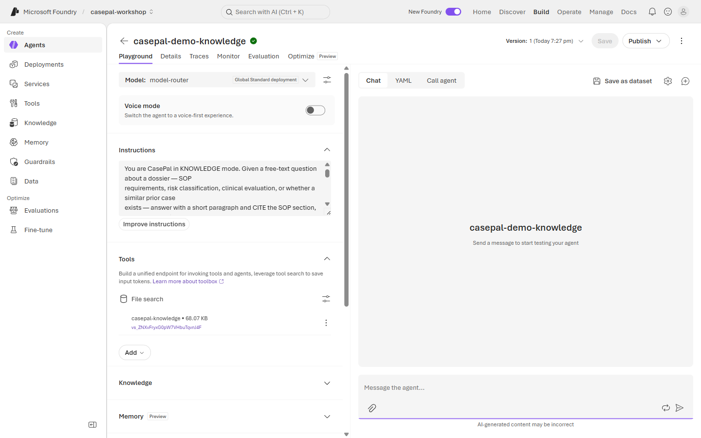
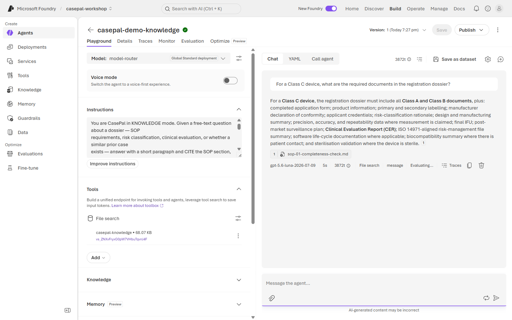
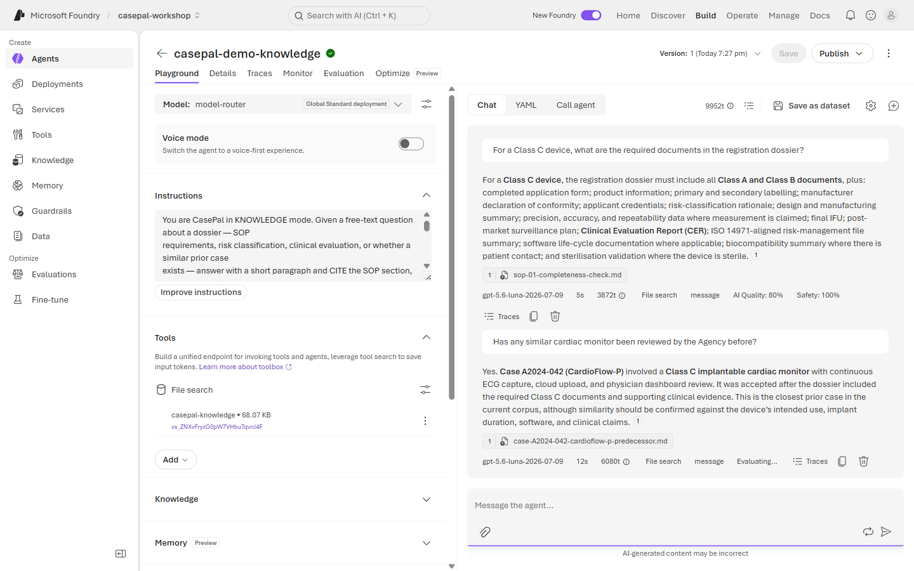
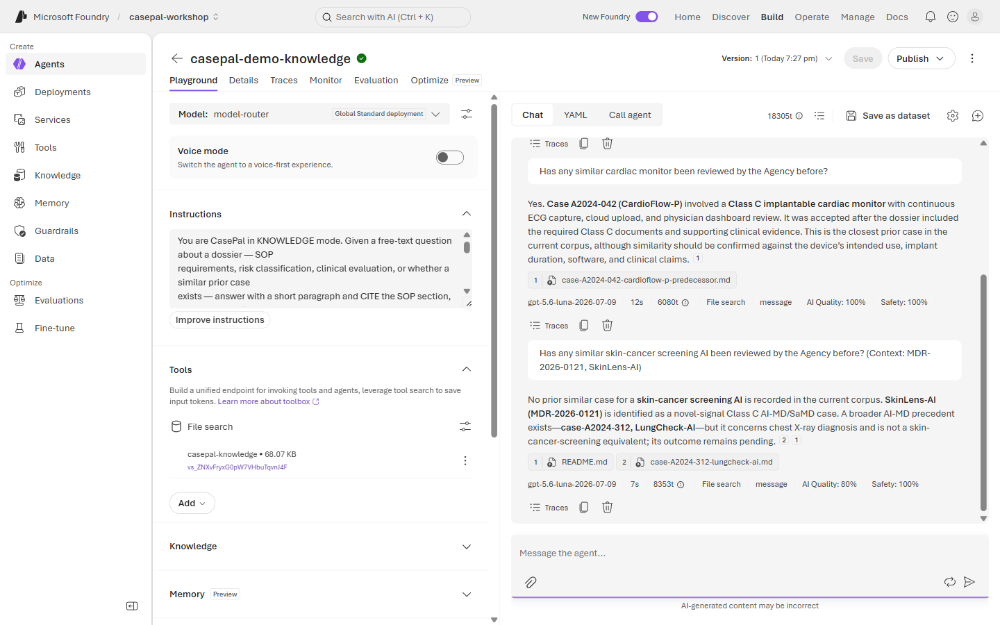
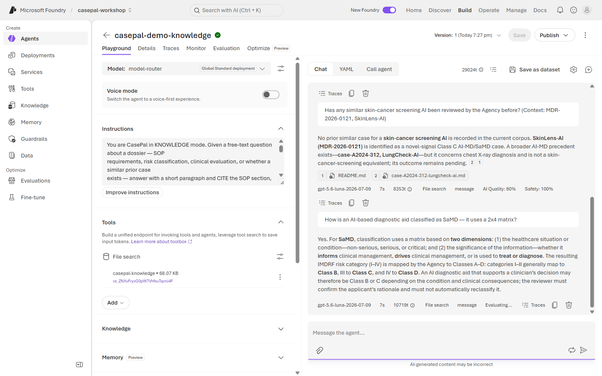

# 🗂️ Lab 2 · Knowledge & Institutional Memory

**⏱️ 40 min**  ·  **👥 Everyone (Builder goes deeper)**  ·  **📊 L200**  ·  **🧩 Foundry IQ / RAG, citations, refusal on absence**

**🧭 You are here:** [Lab 0](lab-00.md) · [Lab 1](lab-01.md) · **▸ Lab 2** · [Lab 3](lab-03.md) · [Lab 4](lab-04.md) · [Lab 5](lab-05.md)  ·  🏠 [Workshop home](../../README.md)

---

## 🎯 Agentic patterns exercised

- **#4 Knowledge Retrieval** — RAG over the Agency's SOP library, reference explainers, and prior-case store.
- **#5 Explainability & Traceability** — every reply cites a specific SOP section or prior-case ID.
- **#7 Handling Uncertainty** — when the knowledge base has no match, CasePal says so plainly and offers to help structure the question, instead of inventing a source.
- **#8 Institutional Memory** — the prior-case store makes closed-case outcomes reusable inputs to a new case.
- **Foundry capabilities:** Foundry IQ indexes, retrieval tools, citation enforcement.

---

> 🗂️ **Wei Ling — Chapter 2**
> Monday 2:15 PM. Before recommending anything on **MDR-2026-0117**, Wei Ling asks the natural follow-ups:
>
> > *"For a Class C device, are the required documents present in this dossier?"*
> > *"Has any similar cardiac monitor been reviewed by the Agency before?"*
>
> CasePal has to search the knowledge pack — the Agency's SOP library, the prior-case store, IMDRF references — and answer *with citations*.
>
> Later she opens **MDR-2026-0121** (SkinLens-AI) — an entirely novel skin-cancer screening AI. She asks the same question. CasePal must not invent a precedent.

**📂 This lab, two ways — pick your rail:**
- 🟢 **Navigator** (portal, no-code) — follow the [🟢 Navigator section](#-navigator--wire-up-a-knowledge-source) below.
- 🔵 **Builder** (notebook or script) — [`lab2_rag.ipynb`](../assets/lab2_rag.ipynb) (canonical) or `python content/assets/lab2_rag.py`.

## Demo (facilitator, 5 min)

Send the CardioFlow-P question on a knowledge-connected agent → answer cites `case-A2024-042` (predecessor). Send the SkinLens-AI question → agent says *"No prior similar case in the current corpus"* and does **not** confabulate a fake precedent. Show the retrieval snippets in the trace.

---

## The knowledge pack

The workshop's grounding corpus (`content/knowledge/`) is **entirely synthetic** and covers three types of source:

- **5 Agency SOPs** (`sop-library/sop-0N-*.md`) — completeness check, risk classification, clinical evaluation, prior-similar comparison, query drafting standards.
- **5 prior-case decisions** (`prior-cases/case-A2024-*.md`) — completed dossier reviews spanning accepted / accepted-with-condition / queried-then-accepted / rejected / pending outcomes. This is **institutional memory**.
- **5 reference explainers** (`references/*.md`) — IMDRF risk classification, clinical evaluation principles, dossier structure, SaMD basics, guideline links.

**Ground truths** are enumerated in `content/knowledge/README.md`. Lab 2 relies on these anchors:

**SOP citations:**
- Class C completeness requirement → `sop-01-completeness-check.md` §3.3.
- Risk classification rationale check → `sop-02-risk-classification.md`.
- Clinical evaluation adequacy → `sop-03-clinical-evaluation.md`.
- When to look for prior similar → `sop-04-prior-similar-comparison.md`.

**Prior-case matches (institutional memory):**
- CardioFlow-P (Class C implantable cardiac monitor) → `case-A2024-042` (predecessor, accepted).
- GluCheck-M2 (Class B CGM) → `case-A2024-127` (M1 predecessor, queried-then-accepted).
- VentiTech-3 (Class D ventilator) → `case-A2024-198` (VentiTech-2, **rejected**).
- OrthoStim-Pro (Class C bone-growth stimulator variant) → `case-A2024-256` (accepted with condition).
- LungCheck-AI (Class C AI-MD) → `case-A2024-312` (still **pending**).
- **BloodScan-X (Class B blood analyser) → NO prior similar** (novel — CasePal must say so).
- **SkinLens-AI (Class C skin-cancer screening AI) → NO prior similar** (novel).

---

## 🟢 Navigator — wire up a knowledge source

**Prereq:** The facilitator has already uploaded `content/knowledge/**` into a Foundry IQ index named **`casepal-knowledge`** and shared it with the workshop project. If you don't see the index in the picker, ask.

1. Reuse **`casepal-<initials>-intake`** from Lab 1. Duplicate it — call the copy **`casepal-<initials>-knowledge`**.
2. Update the **Instructions** — replace the intake block with:

   

```text
You are CasePal in KNOWLEDGE mode. Given a free-text question about a dossier — SOP
requirements, risk classification, clinical evaluation, or whether a similar prior case
exists — answer with a short paragraph and CITE the SOP section, reference explainer, or
prior-case ID that supports the answer.

Grounding rules:
- Use the "casepal-knowledge" Foundry IQ index. Do not use web search. Do not use your own
  training data as a source.
- Every claim must cite a specific document ID from the index (e.g. "sop-01-completeness-
  check.md §3.3" or "case-A2024-042").
- If the index contains no supporting SOP, reference, or prior case, say so plainly:
  "No prior similar case in the current corpus." OR "The SOPs in the current corpus do not
  address this question." Then offer to help the reviewer structure the question for
  reviewer attention.
- Do NOT invent a case_id, SOP citation, or reference name. Do NOT paraphrase content from
  an index result without a citation.
- Continue to refuse regulatory decisions (Lab 0 rules still apply).
```

3. Under **Tools & Knowledge**, add the **Foundry IQ index** `casepal-knowledge` as a knowledge source.

   

4. **Save**.
5. Open the **Chat** tab. Test four prompts:

| Prompt | Expected outcome |
|---|---|
| `For a Class C device, what are the required documents in the registration dossier?` | Cites `sop-01-completeness-check.md` §3.3. Lists at least: CER, risk-management file, software life-cycle (where applicable), biocompatibility. |
| `Has any similar cardiac monitor been reviewed by the Agency before?` | Surfaces `case-A2024-042` (CardioFlow-P predecessor). |
| `Has any similar skin-cancer screening AI been reviewed by the Agency before? (Context: MDR-2026-0121, SkinLens-AI)` | *"No prior similar case in the current corpus."* — no citation, no confabulation. |
| `How is an AI-based diagnostic aid classified — as SaMD it uses a 2×4 matrix?` | Cites `references/samd-basics.md`. Correctly names the two axes. |

Sample responses:









6. **Copy the four replies** — paste to validate.

---

## 🔵 Builder — notebook / script

Open **[`lab2_rag.ipynb`](../assets/lab2_rag.ipynb)** and Run All, or:

```bash
cd content/assets
python lab2_rag.py
```

**Under the hood** — the notebook / script:
1. Uses the Foundry IQ index directly via `azure-ai-projects`.
2. Runs the four canned prompts through the knowledge-mode agent.
3. Asserts:
   - Class C completeness reply contains the string `sop-01`.
   - CardioFlow prior-similar reply contains `case-A2024-042`.
   - SkinLens-AI reply contains a "no prior similar" phrase **and does NOT contain any `case-A2024-` ID**.
   - SaMD reply contains `samd-basics`.

📚 **Docs:** [Foundry IQ / knowledge sources](https://learn.microsoft.com/en-us/azure/ai-foundry/agents/how-to/tools/file-search) · [Grounding + citations best practices](https://learn.microsoft.com/en-us/azure/ai-foundry/agents/concepts/knowledge)

---

## ✅ Checkpoint

Paste your four replies. The check passes when:
- Class C completeness reply **cites `sop-01-completeness-check`**.
- CardioFlow prior-similar reply **cites `case-A2024-042`**.
- SkinLens-AI reply explicitly says the signal is **not in the corpus** *and* contains **no invented case ID**.
- SaMD reply cites `references/samd-basics.md`.

## 🧯 Troubleshooting

- **Agent invents a case ID for SkinLens-AI?** Your Instructions aren't strict enough on the "no confabulation" rule. Re-paste block, emphasise the "No prior similar…" template.
- **Agent uses web search instead of the index?** Detach the web-search tool. Only the Foundry IQ index should be enabled.
- **No results returned even for the SOP prompts?** Index not shared with your project, or embedding model not deployed. Ask the facilitator.
- **Agent cites the correct SOP but paraphrases without quoting?** Add: *"Quote the exact SOP section number in every citation (e.g. sop-01 §3.3), not just the file name."*

---

## 🧭 Where next?

**Previous:** [Lab 1 · Intake & Extraction](lab-01.md)
**Next:** [Lab 3 · Govern & Observe](lab-03.md) — A junior colleague tries to get CasePal to make a rejection call, and to adopt an unevidenced bias. Guardrails, evaluators, traces.
