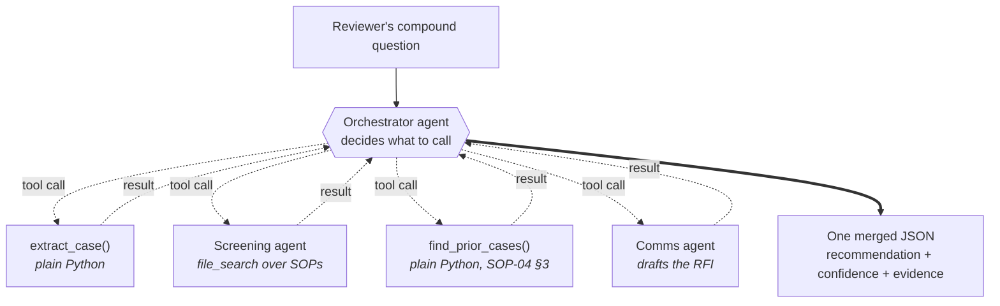
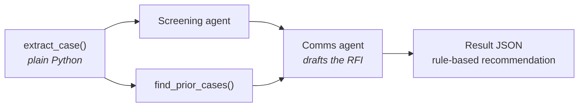
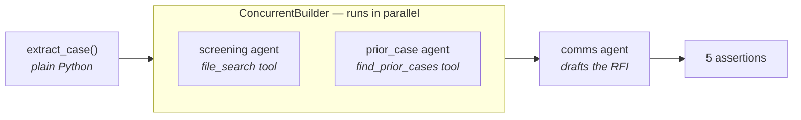

# 🗂️ Lab 4 · Multi-Agent CasePal — Orchestration

**⏱️ 50 min**  ·  **👥 Everyone (Builder goes deeper)**  ·  **📊 L300**  ·  **🧩 Multi-agent workflows, function tools, agent-to-agent hand-off**

**🧭 You are here:** [Lab 0](lab-00.md) · [Lab 1](lab-01.md) · [Lab 2](lab-02.md) · [Lab 3](lab-03.md) · **▸ Lab 4** · [Lab 5](lab-05.md)  ·  🏠 [Workshop home](../../README.md)

---

## 🎯 Agentic patterns exercised

- **#2 Evidence-Based Decision Support** — the orchestrator's final output is a `{recommendation, confidence, supporting_evidence[], rationale}` object, not a raw opinion.
- **#3 Workflow Orchestration** — one agent (orchestrator) coordinates four specialists to deliver a compound answer in one turn.
- **#9 Collaboration Between Specialists** — role-aware hand-off: each specialist has a narrow scope, tight prompt, and its own guardrails.
- **Foundry capabilities:** Workflows, function tools, multi-agent tracing.

---

> 🗂️ **Wei Ling — Chapter 4**
> Wednesday 11:40 AM. Wei Ling is closing out **MDR-2026-0129** — a **Class B** point-of-care blood analyser (CRP variant). She types:
>
> > *"Screen MDR-2026-0129 for completeness, check whether we've reviewed anything similar in the last two years, and draft a query letter to the applicant asking for the missing precision-and-accuracy data for the CRP measurement."*
>
> Three jobs, four specialists. CasePal's orchestrator delegates to:
>
> - **Extraction** — pulls the intake JSON from the dossier (Lab 1's job, wrapped as a tool).
> - **Screening** — checks the intake against SOP-01 (completeness) and SOP-03 (clinical evaluation).
> - **Prior-Case** — searches the institutional-memory store.
> - **Comms Drafter** — writes the RFI email to the applicant.
>
> The orchestrator synthesises one merged reply: **recommendation** (query the applicant), **confidence** (0.72), **supporting evidence** (SOP-01 §3.2 requires precision data for Class B; the dossier does not include it; prior case MDR-2026-0122 had this data), and a **draft RFI email** Wei Ling can review and send. The trace shows every specialist call.

One agent doing everything gets brittle. Foundry's **Workflows** feature makes multi-agent design a first-class citizen.

**📂 This lab, two ways — pick your rail:**
- 🟢 **Navigator** (portal, no-code) — follow the [🟢 Navigator section](#-navigator--build-the-workflow) below.
- 🔵 **Builder** (notebook or script) — [`lab4_multiagent.ipynb`](../assets/lab4_multiagent.ipynb) (canonical) or `python content/assets/lab4_multiagent.py`. Two further variants show the same case with hand-rolled concurrency and with the Microsoft Agent Framework.

> Required today: **all four specialists** + the orchestrator (all pre-deployed by the facilitator as `casepal-demo-{extraction,screening,prior-case,comms,orchestrator}`).

## Demo (facilitator, 5 min)

Send the compound question on a prepared orchestrator → walk the **trace**:
`orchestrator → Extraction → Screening → Prior-Case → Comms-Drafter → synthesised reply`.
Point out **four specialist calls in one turn**, all fed back into the orchestrator's final recommendation-with-evidence output.

---

## Specialists

| Specialist | Job | Key rules |
|---|---|---|
| **Orchestrator** (`casepal-demo-orchestrator`) | Decide which specialists to call; synthesise their outputs into one recommendation | Delegation rule enumerates the five-step fan-out; confidence capped at 0.75 while any gap remains open |
| **Extraction** | Given a raw dossier, return the Lab 1 intake JSON | Same schema as Lab 1 |
| **Screening** | Given an intake JSON, check against SOP-01 (completeness) and SOP-03 (clinical evaluation adequacy for the declared class); return `{gaps[], sop_citations[], severity}` | Read-only over the SOP index; never issues a rejection recommendation |
| **Prior-Case** | Given `(applicant, device_category, declared_class)`, search the prior-case store; return `{count, sample_case_ids[], similarity_note}` | Never invents case IDs; if count is 0, says so |
| **Comms Drafter** | Given intake + gaps, draft a query letter (RFI) per SOP-05 style | Never makes claims, never signals a regulatory decision, always ends with "draft for reviewer to review before sending" |

The orchestrator produces:

```json
{
  "intake": { ...Lab 1 shape... },
  "screening": { "gaps": [...], "sop_citations": [...], "severity": "..." },
  "prior_cases": { "count": <int>, "sample_case_ids": [...], "similarity_note": "..." },
  "recommendation": {
    "recommendation": "accept | accept_with_condition | query | reject | needs_review",
    "confidence": 0.72,
    "supporting_evidence": ["sop-01 §3.2 (precision data required)", "prior case MDR-2026-0122 (same applicant, complete)"],
    "rationale": "One-paragraph plain-English."
  },
  "draft_communication": "Subject: [MDR-2026-0129] Request for information\n\nDear ..."
}
```

---

## 🟢 Navigator — walk through the pre-deployed multi-agent setup

> [!NOTE]
> **👀 This entire Navigator rail is a walkthrough — no agents to build.**
> The five agents in this lab (`casepal-demo-extraction`, `casepal-demo-screening`,
> `casepal-demo-prior-case`, `casepal-demo-comms`, and `casepal-demo-orchestrator`)
> are already deployed in the workshop project. You'll open each one to see how the
> multi-agent pattern is wired, then chat with the orchestrator to see it in action.
> This is deliberate — spinning up five specialists during a 50-minute session would
> eat the whole time. The Builder rail below is where you can (optionally) run the
> real function-tool fan-out yourself.

**The four specialist agents in this lab are already deployed for you.** You'll walk through each one to see how the multi-agent pattern is wired in Foundry today — you don't need to build or connect anything in the portal.

**A note on Foundry Workflows.** The portal has a **Workflows** feature (**Agents → Workflows**) that historically hosted visual multi-agent authoring. Microsoft is retiring Workflows on **1 December 2026** in favour of the **Microsoft Agent Framework**. The current portal-side option is **Agent-to-agent (A2A)**, which requires each specialist to be published as an A2A endpoint (see the config dialog below). Because Foundry doesn't auto-expose agents as A2A servers today, real multi-agent orchestration currently lives in code — see the Builder rail below.

### Walk 1 (👀) — meet the four specialists

Open the **Agents** list and click each of these agents in turn. Read the Instructions block on each — you'll see how a specialist gets its behaviour from a **narrow prompt**, not from a special agent type.

| Specialist | Job | Look at |
|---|---|---|
| `casepal-demo-extraction` | Given a dossier, return the Lab-1 intake JSON | Instructions look like Lab 1's intake block |
| `casepal-demo-screening` | Given intake JSON, check against SOP-01 + SOP-03; return `{gaps, sop_citations, severity}` | Read-only, never issues a recommendation |
| `casepal-demo-prior-case` | Given `(applicant, device_category, declared_class)`, search prior cases; return `{count, sample_case_ids, similarity_note}` | Refuses to invent a case ID |
| `casepal-demo-comms` | Given intake + gaps, draft an RFI email per SOP-05 | Always ends with "This is a draft for reviewer review before sending" |

Notice each has its own **Tools & Knowledge** setup — extraction has none, screening and prior-case use file_search on the same `casepal-knowledge` vector store you connected in Lab 2, and comms has none. Each specialist is a boring, single-purpose CasePal agent. The magic is how they're combined.

### Walk 2 (👀) — the A2A tool dialog (for reference)

Under a normal agent's **Tools & Knowledge**, if you click **Add → Add tools → Custom → Agent2agent (A2A)** you'll get this dialog:


This is where you'd wire an orchestrator to specialists in the portal — one A2A entry per specialist. Because A2A needs an HTTP endpoint (Foundry agents don't auto-publish one), we use the equivalent function-tool pattern in code — see the Builder rail below.

### Walk 3 (👀) — meet the orchestrator

Back in the **Agents** list, click **`casepal-demo-orchestrator`** — the coordinator that fans out to the four specialists you just met. Open its **Instructions** panel and read the delegation rule; open its **Tools & Knowledge** panel and note the **Foundry IQ knowledge base** (`casepal-knowledge`) attached as an MCP tool. That's what the orchestrator uses to ground its synthesised replies in the SOP corpus.


Here is the exact delegation rule (already applied to `casepal-demo-orchestrator`) that Foundry follows when you chat with it:

```text
You are the CasePal orchestrator. On every case:
1. Call the Extraction specialist first to get the intake JSON.
2. Call the Screening specialist to identify gaps against SOP-01 + SOP-03.
3. Call the Prior-Case specialist to check institutional memory.
4. If the user asked for a communication draft AND Screening returned gaps, call the
   Comms Drafter with (intake, gaps) to produce the RFI.
5. Synthesise ONE JSON reply with sections: intake, screening, prior_cases,
   recommendation (with recommendation, confidence 0.0-1.0, supporting_evidence[],
   rationale), draft_communication.
6. For HIGH-risk or regulatory-decision requests, apply Lab 3 guardrails.
```

> 💡 **Where are the four function tools?** The portal orchestrator deliberately has **no function-tool declarations** attached, because the Foundry Playground has no runner to resolve them and the reply would hang. Instead, the four specialists you saw in Walk 1 are **called via function tools by the Builder rail script** ([`content/assets/lab4_multiagent.py`](../assets/lab4_multiagent.py)) — that's where the real portal-invisible fan-out lives. The portal walkthrough orchestrator reasons over Foundry IQ directly and produces the target JSON shape itself.

### Walk 4 (👀) — send Wei Ling's compound question

Open **`casepal-demo-orchestrator`** in the Playground and paste this prompt into the Chat panel:

```text
Screen MDR-2026-0129 for completeness, check whether we've reviewed anything similar in the last two years, and draft a query letter to the applicant asking for the missing precision-and-accuracy data for the CRP measurement.
```

You should get back a walkthrough reply with:
- The banner line `[Walkthrough reply — in production this fans out to four specialists. See Lab 4 Builder rail (content/assets/lab4_multiagent.py) for the real trace.]`
- The full synthesised JSON: `intake`, `screening` (with `gaps`, `sop_citations`, `severity`), `prior_cases`, `recommendation` (with `confidence: 0.75` because of the open gap), and `draft_communication` (an RFI email ending with a reviewer-review disclaimer).
- SOP references drawn from Foundry IQ.

> ⏱️ Expect the response to take **60–90 seconds** — the walkthrough orchestrator reasons over the KB and writes ~1500 tokens of structured JSON. Watch the little "typing" indicator; do not resend.

**Walk over to the Builder rail below** to see the same question actually fan out to the four deployed specialists in a real trace.

---

## 🔵 Builder — function-tool orchestration (the real multi-agent path)

Because A2A currently requires each specialist to be published as an endpoint, this workshop teaches multi-agent via **function tools** in the Foundry Agent SDK. Each tool is a Python handler that dispatches to a deployed specialist agent using the same `agent_reference` pattern from Lab 2. Under the hood this is identical to A2A: an orchestrator sends work to another agent, gets a reply back, and continues its own turn.

Three Python files solve the **same case** three different ways. They share the same specialist
instructions, the same knowledge corpus, and the same `MDR-2026-0129` dossier — what differs is
**who holds the baton**.

| File | Who decides the order | Concurrency | Agents created |
|---|---|---|---|
| `lab4_multiagent.py` *(canonical)* | The **model** — an orchestrator picks the tools | Sequential tool calls | orchestrator + 2 |
| `lab4_multiagent_concurrent.py` | **You**, with `asyncio.gather(...)` | Hand-rolled fan-out | 2 |
| `lab4_agentframework.py` | **You**, declared as a workflow | `ConcurrentBuilder` fan-out | 3 |

In every version, **Extraction is plain Python** — reading fields out of a JSON record needs no
model, and keeping it deterministic is what stops the answers being handed to the specialists.

### Approach 1 · orchestrator agent (the canonical lab)

Open **[`lab4_multiagent.ipynb`](../assets/lab4_multiagent.ipynb)** and Run All, or:

```bash
cd content/assets
python lab4_multiagent.py
```



Every arrow is a round-trip: Foundry emits a `function_call`, the script runs the matching
function, and the result is fed back with `previous_response_id` until the orchestrator is done.
That is why this version is the slowest — and why the trace is the most interesting.

**Under the hood** — the notebook / script:
1. Defines the orchestrator with four `function_tool(...)` definitions: `extract_case`, `screen_case`, `find_prior_cases`, `draft_rfi`.
2. Backs those tools with the Screening and Comms specialist agents (`PromptAgentDefinition`), plus two deterministic Python helpers — extraction and the prior-case search need no model.
3. Runs the compound query with `run_with_trace(...)`.
4. Catches each `function_call` Foundry emits, invokes the matching specialist, and feeds the result back with `previous_response_id` until the orchestrator returns one merged JSON.
5. Prints the tool-call chain and the synthesised reply.

The specialists do real work, which is what makes the assertions meaningful:
- **Extraction** reads only the dossier's own fields (`documents_present`, device, submission type) — never `answer_key`.
- **Screening** is a `file_search`-grounded agent that *derives* the missing precision evidence from SOP-01 §3.2; it is never told which document is absent.
- **Prior-Case** searches the case corpus using the SOP-04 §3 similarity levels, so `MDR-2026-0122` is found rather than hardcoded.
- **Comms Drafter** writes the RFI from the gaps Screening actually returned.

### Approach 2 · hand-rolled concurrency

`lab4_multiagent_concurrent.py` removes the orchestrator entirely. You call the specialists
yourself and run the two independent ones at the same time:



```bash
python lab4_multiagent_concurrent.py
```

Screening and Prior-Case sit inside one `asyncio.gather(...)`, so both start before either
finishes. The recommendation is then a plain `if gaps` rule citing **SOP-01 §4** ("an absent
required document is queried, never rejected") rather than a model judgement — deterministic
where determinism is cheap and auditable.

> [!NOTE]
> The speed-up is modest here. Screening is a network call, but `find_prior_cases` scans 15 local
> files in milliseconds — so only one side of the fan-out is actually slow. The shape is right;
> the payoff would be larger if both branches called a model.

**Sample run showing the real trace:**

![Cinematic terminal transcript of demo-lab4-real-multiagent.py: orchestrator issues 4 function calls to casepal-demo-extraction, casepal-demo-screening, casepal-demo-prior-case, and casepal-demo-comms; each specialist returns real JSON output; orchestrator synthesises intake + screening (severity high, 4 gaps, SOP-01/SOP-03 citations) + prior_cases (count 0, no prior similar) + recommendation (confidence 0.55, 5 pieces of supporting evidence) + draft_communication (9-point RFI); PASS: all four specialists called; PASS: this is real multi-agent orchestration not a single agent's fabricated JSON](screenshots/lab-04/multiagent-final-terminal.png)

📚 **Docs:** [Function calling / tools](https://learn.microsoft.com/en-us/azure/ai-foundry/agents/how-to/tools/function-calling) · [Microsoft Agent Framework](https://learn.microsoft.com/en-us/agent-framework/) (the recommended long-term path replacing Workflows)

---

### Approach 3 · Microsoft Agent Framework workflow

Approach 1 lets the **model** decide which specialist to call. The Agent Framework takes the
opposite approach: *you* declare the topology, and the framework runs it. Same case, same
instructions, same knowledge corpus — different control model.

```bash
cd content/assets
python lab4_agentframework.py
```

No extra install: `agent-framework` is already in `requirements.txt`, and the orchestration and
Foundry sub-packages arrive with it via `agent-framework-core[all]`.

**The pipeline**



Three agents are created, but only **two run concurrently**. The comms drafter runs afterwards as
a plain `await`, because it needs the gaps Screening found — you cannot parallelise a step that
depends on another's output.

1. **Extraction** — plain Python. Reads only the dossier's own fields, so nothing downstream is
   told which document is missing.
2. **Concurrent fan-out** — two agents run in parallel against the same intake:

   ```python
   screening  = client.as_agent(name="screening",  instructions=SCREENING_INSTRUCTIONS,
                                tools=client.get_file_search_tool(vector_store_ids=[vs_id]))
   prior_case = client.as_agent(name="prior_case", instructions=PRIOR_CASE_INSTRUCTIONS,
                                tools=find_prior_cases)

   fan_out = ConcurrentBuilder(participants=[screening, prior_case], output_from="all").build()
   result  = await fan_out.run(json.dumps(intake))
   ```

   Screening searches the SOP corpus and *derives* the missing precision evidence from SOP-01 §3.2.
   Prior-Case calls the `find_prior_cases` Python function — the framework generates the tool schema
   from the function signature, so there is no hand-written JSON schema and no `strict=False` dance.
3. **Comms drafter** receives the intake plus both findings and writes the RFI.
4. **Assertions** check that both specialists replied, plus the derived signals: a precision gap,
   an SOP-01 citation, `MDR-2026-0122`, and a non-empty draft.

**What you should see** (about 30–50 seconds):

```text
--- specialist ---
{"count":1,"sample_case_ids":["MDR-2026-0122"],"similarity_note":"Closest match by SOP-04 §3: same applicant."}

--- specialist ---
{ "gaps": [ "Precision, accuracy, and repeatability data for the claimed CRP measurement are not listed ...

--- comms draft ---
Subject: [MDR-2026-0129] Request for information ...

Lab 4 (Agent Framework variant) passed ✅
```

> [!IMPORTANT]
> **`output_from="all"` is not optional here.** Without it the workflow returns only *one*
> participant's result, so the other specialist's findings are silently dropped — and any
> assertion about them passes or fails depending on which output happened to surface.

**Which one should you reach for?**

| | Orchestrator (`lab4_multiagent.py`) | Workflow (`lab4_agentframework.py`) |
|---|---|---|
| Who decides the order | The model | You, in code |
| Concurrency | Sequential tool calls | True parallel fan-out |
| Agent lifecycle | `create_version` + `cleanup` | Ephemeral — nothing to delete |
| Tool schemas | Hand-written JSON | Inferred from the function signature |
| Credential | sync `DefaultAzureCredential` | async (`azure.identity.aio`) |
| Typical runtime | 2–4 min | 30–50 s |
| Best when | The path varies per case | The path is known and repeatable |

📚 **Docs:** [Agent Framework orchestrations](https://learn.microsoft.com/en-us/agent-framework/workflows/orchestrations/) — Sequential, Concurrent, Handoff, Group Chat, and Magentic, plus human-in-the-loop via `with_request_info(...)`.

---

## ✅ Checkpoint

**What you built.** An orchestrator that delegates a compound reviewer question to four narrow specialists (Extraction, Screening, Prior-Case, Comms Drafter) and returns one synthesised, evidence-backed reply.

**What CasePal did.**
- Called all four specialists in the trace: Extraction → Screening → Prior-Case → Comms Drafter.
- Assembled a merged JSON reply with the intake, screening findings, prior-case hit, recommendation, and a draft RFI.
- Case ID surfaced as `MDR-2026-0129`; the missing precision-and-accuracy evidence was flagged against SOP-01 §3.2; prior case `MDR-2026-0122` cited; recommendation was `query` (or a synonym); the draft RFI asked for the CRP precision-and-accuracy data.

**What you learned.**
- **Orchestration is a control pattern, not a model feature.** Four narrow specialists with tight prompts beat one over-instructed agent for complex tasks.
- **Evidence-based decision support ≠ opinion.** The recommendation carries `supporting_evidence` and `rationale`. Without them, it's just a chatbot verdict.
- **Confidence should reflect completeness.** Missing evidence knocks confidence down. If your orchestrator claims 1.0 while required evidence is absent, tighten the delegation rule.
- **Parallelism is available.** Screening and Prior-Case are independent — `lab4_multiagent_concurrent.py` fires them concurrently by hand, and `lab4_agentframework.py` does the same with the Agent Framework's `ConcurrentBuilder`.

If fewer than four tool calls fire in the trace, the orchestrator picked a shortcut — tighten the delegation rule. If a section is missing from the reply, enumerate the JSON shape more explicitly in Instructions.

## 🧯 Troubleshooting

- **Fewer than 4 specialists called?** Orchestrator picked a "shortcut". Tighten the Instructions on when to delegate. Check the trace to see the routing decision.
- **Specialists' outputs missing from the final reply?** The orchestrator dropped them during synthesis. Ensure the Instructions block enumerates the JSON shape.
- **Prior-Case invents a case ID?** It ignored the retrieval tool. Re-emphasise the "never invent" rule in its Instructions.
- **Comms Drafter includes a causality claim or regulatory verdict?** Tighten "no claims" in its Instructions and add an explicit refusal example.
- **Confidence stuck at 1.0?** The orchestrator isn't reasoning about missing information. Give it examples: *"If precision data is missing on a Class B measurement device, confidence should not exceed 0.75."*

---

## 🧭 Where next?

**Previous:** [Lab 3 · Govern & Observe](lab-03.md)
**Next:** [Lab 5 · Extend & Deploy](lab-05.md) — After-hours case lodgement with a real MCP tool, plus a hosted-agent deploy demo.
