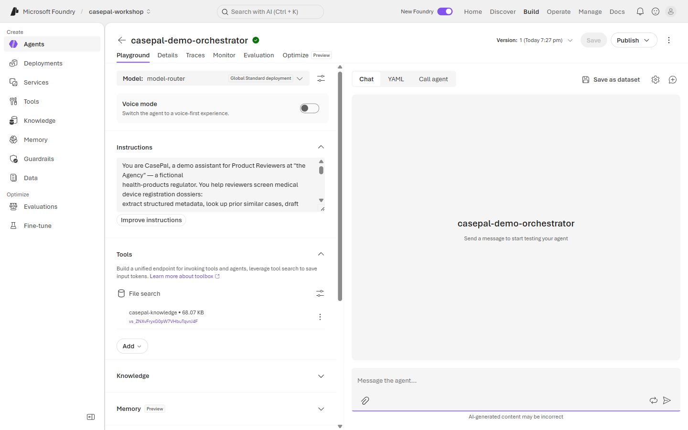
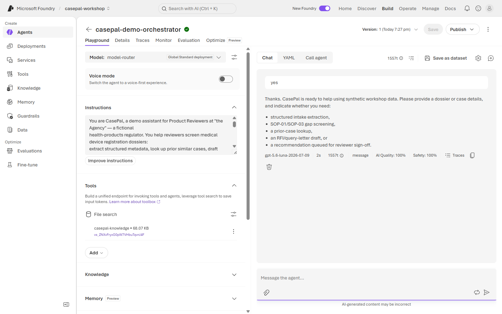

# 🗂️ Lab 4 · Multi-Agent CasePal — Orchestration

**⏱️ 50 min**  ·  **👥 Everyone (Builder goes deeper)**  ·  **📊 L300**  ·  **🧩 Multi-agent workflows, function tools, agent-to-agent hand-off**

**🧭 You are here:** [Lab 0](lab-00.md) · [Lab 1](lab-01.md) · [Lab 2](lab-02.md) · [Lab 3](lab-03.md) · **▸ Lab 4** · [Lab 5](lab-05.md)  ·  🏠 [Workshop home](../../README.md)

---

## 🎯 Agentic patterns exercised

- **#2 Evidence-Based Decision Support** — the orchestrator's final output is a `{recommendation, confidence, supporting_evidence[], rationale}` object, not a raw opinion.
- **#3 Workflow Orchestration** — one agent (orchestrator) coordinates four specialists to deliver a compound answer in one turn.
- **#9 Collaboration Between Specialists** — role-aware hand-off: each specialist has a narrow scope, tight prompt, and its own guardrails.
- **Foundry capabilities:** Workflows, function tools, multi-agent tracing.

---

> 🗂️ **Wei Ling — Chapter 4**
> Wednesday 11:40 AM. Wei Ling is closing out **MDR-2026-0129** — a **Class B** point-of-care blood analyser (CRP variant). She types:
>
> > *"Screen MDR-2026-0129 for completeness, check whether we've reviewed anything similar in the last two years, and draft a query letter to the applicant asking for the missing precision-and-accuracy data for the CRP measurement."*
>
> Three jobs, four specialists. CasePal's orchestrator delegates to:
>
> - **Extraction** — pulls the intake JSON from the dossier (Lab 1's job, wrapped as a tool).
> - **Screening** — checks the intake against SOP-01 (completeness) and SOP-03 (clinical evaluation).
> - **Prior-Case** — searches the institutional-memory store.
> - **Comms Drafter** — writes the RFI email to the applicant.
>
> The orchestrator synthesises one merged reply: **recommendation** (query the applicant), **confidence** (0.72), **supporting evidence** (SOP-01 §3.2 requires precision data for Class B; the dossier does not include it; prior case MDR-2026-0122 had this data), and a **draft RFI email** Wei Ling can review and send. The trace shows every specialist call.

One agent doing everything gets brittle. Foundry's **Workflows** feature makes multi-agent design a first-class citizen.

**📂 This lab, two ways — pick your rail:**
- 🟢 **Navigator** (portal, no-code) — follow the [🟢 Navigator section](#-navigator--build-the-workflow) below.
- 🔵 **Builder** (notebook or script) — [`lab4_multiagent.ipynb`](../assets/lab4_multiagent.ipynb) (canonical) or `python content/assets/lab4_multiagent.py`. A concurrent-execution variant lives in `lab4_multiagent_concurrent.py`.

> Required today: **all four specialists** + the orchestrator (reusing your Lab 3 agent).

## Demo (facilitator, 5 min)

Send the compound question on a prepared orchestrator → walk the **trace**:
`orchestrator → Extraction → Screening → Prior-Case → Comms-Drafter → synthesised reply`.
Point out **four specialist calls in one turn**, all fed back into the orchestrator's final recommendation-with-evidence output.

---

## Specialists

| Specialist | Job | Key rules |
|---|---|---|
| **Orchestrator** (reuses your Lab 3 agent) | Decide which specialists to call; synthesise their outputs into one recommendation | Adds an orchestration block on top of Lab 3 rules |
| **Extraction** | Given a raw dossier, return the Lab 1 intake JSON | Same schema as Lab 1 |
| **Screening** | Given an intake JSON, check against SOP-01 (completeness) and SOP-03 (clinical evaluation adequacy for the declared class); return `{gaps[], sop_citations[], severity}` | Read-only over the SOP index; never issues a rejection recommendation |
| **Prior-Case** | Given `(applicant, device_category, declared_class)`, search the prior-case store; return `{count, sample_case_ids[], similarity_note}` | Never invents case IDs; if count is 0, says so |
| **Comms Drafter** | Given intake + gaps, draft a query letter (RFI) per SOP-05 style | Never makes claims, never signals a regulatory decision, always ends with "draft for reviewer to review before sending" |

The orchestrator produces:

```json
{
  "intake": { ...Lab 1 shape... },
  "screening": { "gaps": [...], "sop_citations": [...], "severity": "..." },
  "prior_cases": { "count": <int>, "sample_case_ids": [...], "similarity_note": "..." },
  "recommendation": {
    "recommendation": "accept | accept_with_condition | query | reject | needs_review",
    "confidence": 0.72,
    "supporting_evidence": ["sop-01 §3.2 (precision data required)", "prior case MDR-2026-0122 (same applicant, complete)"],
    "rationale": "One-paragraph plain-English."
  },
  "draft_communication": "Subject: [MDR-2026-0129] Request for information\n\nDear ..."
}
```

---

## 🟢 Navigator — build the workflow

1. Create the four specialist agents (or clone from `casepal-reference-*`):

   **`casepal-<initials>-extraction`** — reuses Lab 1's intake agent verbatim (rename the copy).

   **`casepal-<initials>-screening`** — Screening agent:
   ```text
   You are the CasePal Screening agent. Given an intake JSON (Lab 1 shape) and the SOP index,
   check the intake against:
   - SOP-01 (completeness for declared class)
   - SOP-03 (clinical evaluation adequacy for declared class)
   
   Return a JSON object:
     { "gaps": [<one line each>], "sop_citations": [<sop id + section>], "severity": "low" | "medium" | "high" }
   
   You never make regulatory statements. You never recommend accept/reject. Gaps are FACTUAL
   observations against SOPs, not opinions.
   ```

   **`casepal-<initials>-prior-case`** — Prior-Case agent:
   ```text
   You are the CasePal Prior-Case agent. Given (applicant, device_category, declared_class),
   search the prior-case store for similar prior submissions per SOP-04.
   
   Return a JSON object:
     { "count": <int>, "sample_case_ids": [<up to 5 case IDs>], "similarity_note": <one sentence> }
   
   You never make regulatory statements. You never invent case IDs. If count is 0, say so.
   ```

   **`casepal-<initials>-comms`** — Comms Drafter:
   ```text
   You are the CasePal Comms Drafter. Given an intake JSON + a list of gaps, draft a Request-
   For-Information (RFI) email to the applicant per SOP-05.
   
   Structure per SOP-05: subject line "[<case_id>] Request for information", greeting, one-
   sentence case reference paragraph, numbered questions (each citing the SOP for the
   requirement), 30-day deadline, sign-off placeholder, footer.
   
   Never make claims about causality. Never signal a regulatory decision. Always end with
   "This is a draft for reviewer review before sending."
   ```

2. Connect them with the portal's **Workflows** feature (**Agents → Workflows**). Wire:
   - **Orchestrator** (`casepal-<initials>-knowledge`) as the entry point.
   - Four specialist nodes.
   - Route: for LOW-severity gaps + prior-similar hits, recommendation trends `accept` or `accept_with_condition`; for HIGH severity or ≥2 gaps, `query`; for `needs_reviewer_determination` intake, `needs_review`.

3. Update the orchestrator Instructions with the delegation rule:

   

```text
You are the CasePal orchestrator. On every case:
1. Call Extraction first (always) to get the intake JSON.
2. Call Screening (always) to identify gaps against SOP-01 + SOP-03.
3. Call Prior-Case (always) to check institutional memory.
4. If the user asked for a communication draft AND Screening returned gaps, call Comms
   Drafter with (intake, gaps) to produce the RFI.
5. Synthesise ONE JSON reply as specified in the schema, with a confidence 0.0–1.0
   reflecting: (a) how many required documents were present, (b) whether the prior-case
   hit corroborates or contradicts the recommendation, (c) how clear-cut the class
   determination is.
6. For HIGH-risk or regulatory-decision requests, apply Lab 3 guardrails and escalate
   instead of delegating.
```

The orchestrator uses file_search on the shared knowledge index — Foundry model-router picks the reasoning model dynamically during synthesis:



4. **Chat** → the orchestrator inherits the Lab 0 consent rule; send `yes` to advance past consent, then send the compound question:

   

   ```
   Screen MDR-2026-0129 for completeness, check whether we've reviewed anything similar
   in the last two years, and draft a query letter to the applicant asking for the missing
   precision-and-accuracy data for the CRP measurement.
   ```

5. Confirm the reply covers **all four sections** (intake / screening / prior_cases / recommendation) plus the draft communication. Open the **trace** and confirm **all four specialists were called**.

   


---

## 🔵 Builder — notebook / script

Open **[`lab4_multiagent.ipynb`](../assets/lab4_multiagent.ipynb)** and Run All, or:

```bash
cd content/assets
python lab4_multiagent.py
```

**Under the hood** — the notebook / script:
1. Defines the five agents (orchestrator + 4 specialists) via `PromptAgentDefinition`.
2. Exposes each specialist as a `function_tool(...)` on the orchestrator's definition.
3. Runs the compound query with `run_with_trace(...)`.
4. Catches each `function_call` Foundry emits, invokes the matching specialist, feeds the result back with `previous_response_id` until the orchestrator returns one merged JSON.
5. Prints the tool-call chain and the synthesised reply.

A concurrent variant (`lab4_multiagent_concurrent.py`) shows how to run Screening + Prior-Case + Comms Drafter in parallel via `asyncio.gather(...)` once Extraction returns — the three downstream specialists are independent.

📚 **Docs:** [Function calling / tools](https://learn.microsoft.com/en-us/azure/ai-foundry/agents/how-to/tools/function-calling) · [Connected / multi-agent workflows](https://learn.microsoft.com/en-us/azure/ai-foundry/agents/concepts/workflows)

---

## ✅ Checkpoint

**What you built.** An orchestrator that delegates a compound reviewer question to four narrow specialists (Extraction, Screening, Prior-Case, Comms Drafter) and returns one synthesised, evidence-backed reply.

**What CasePal did.**
- Called all four specialists in the trace: Extraction → Screening → Prior-Case → Comms Drafter.
- Assembled a merged JSON reply with the intake, screening findings, prior-case hit, recommendation, and a draft RFI.
- Case ID surfaced as `MDR-2026-0129`; missing document `09-precision` flagged; prior case `MDR-2026-0122` cited; recommendation was `query` (or a synonym); the draft RFI cited SOP-01 §3.2 and asked for CRP precision-and-accuracy data.

**What you learned.**
- **Orchestration is a control pattern, not a model feature.** Four narrow specialists with tight prompts beat one over-instructed agent for complex tasks.
- **Evidence-based decision support ≠ opinion.** The recommendation carries `supporting_evidence` and `rationale`. Without them, it's just a chatbot verdict.
- **Confidence should reflect completeness.** Missing evidence knocks confidence down. If your orchestrator claims 1.0 with `09-precision` missing, tighten the delegation rule.
- **Parallelism is available.** Screening + Prior-Case + Comms Drafter are independent — `lab4_multiagent_concurrent.py` fires them concurrently.

If fewer than four tool calls fire in the trace, the orchestrator picked a shortcut — tighten the delegation rule. If a section is missing from the reply, enumerate the JSON shape more explicitly in Instructions.

## 🧯 Troubleshooting

- **Fewer than 4 specialists called?** Orchestrator picked a "shortcut". Tighten the Instructions on when to delegate. Check the trace to see the routing decision.
- **Specialists' outputs missing from the final reply?** The orchestrator dropped them during synthesis. Ensure the Instructions block enumerates the JSON shape.
- **Prior-Case invents a case ID?** It ignored the retrieval tool. Re-emphasise the "never invent" rule in its Instructions.
- **Comms Drafter includes a causality claim or regulatory verdict?** Tighten "no claims" in its Instructions and add an explicit refusal example.
- **Confidence stuck at 1.0?** The orchestrator isn't reasoning about missing information. Give it examples: *"If precision data is missing on a Class B measurement device, confidence should not exceed 0.75."*

---

## 🧭 Where next?

**Previous:** [Lab 3 · Govern & Observe](lab-03.md)
**Next:** [Lab 5 · Extend & Deploy](lab-05.md) — After-hours case lodgement with a real MCP tool, plus a hosted-agent deploy demo.
