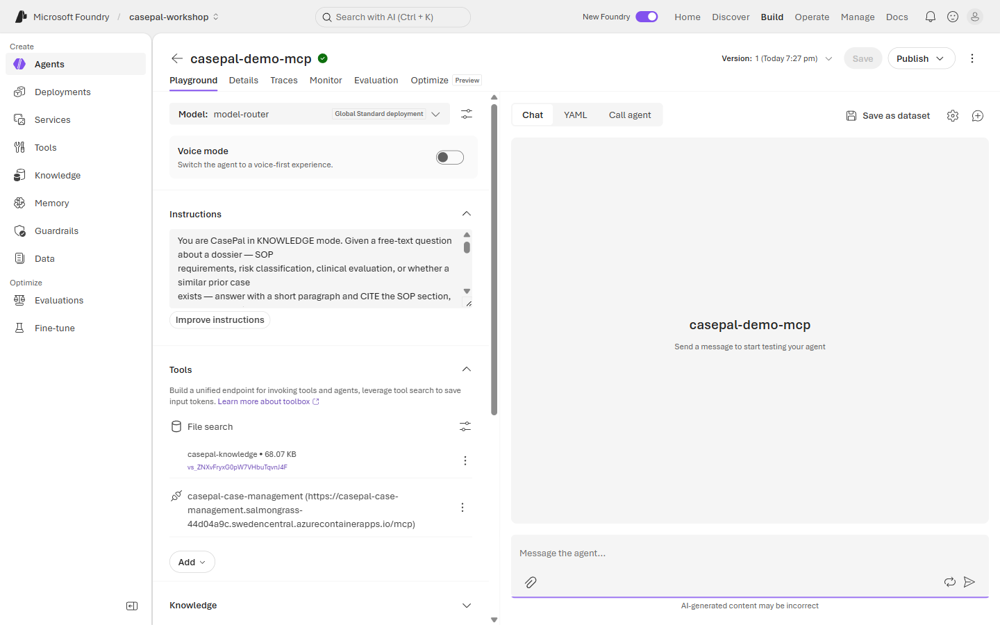
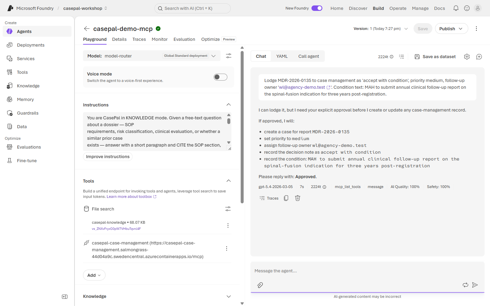
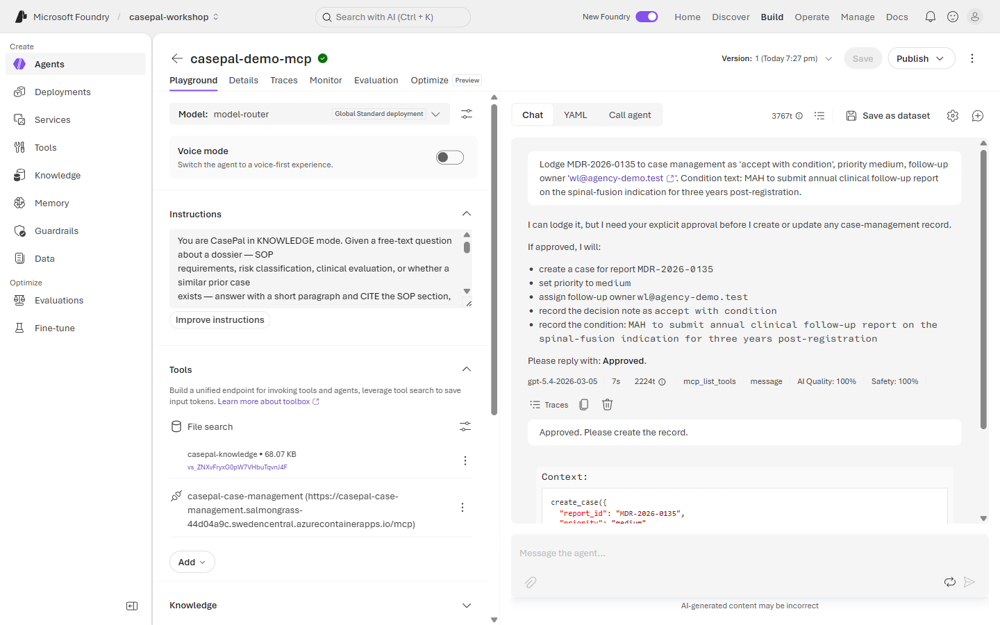
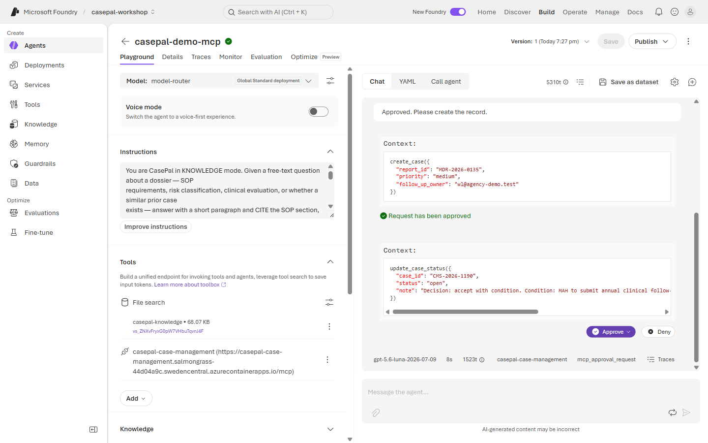
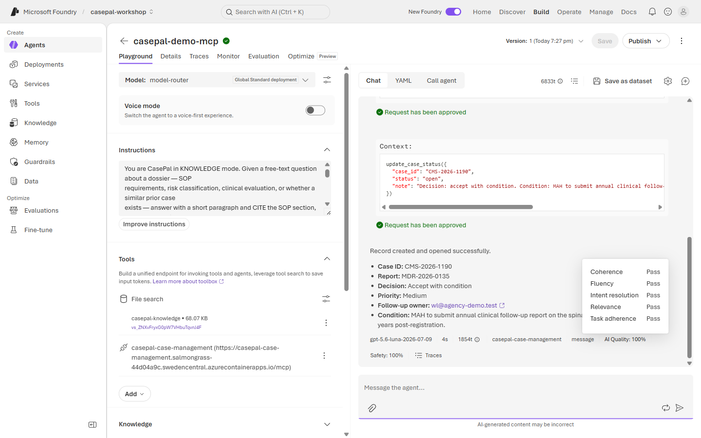
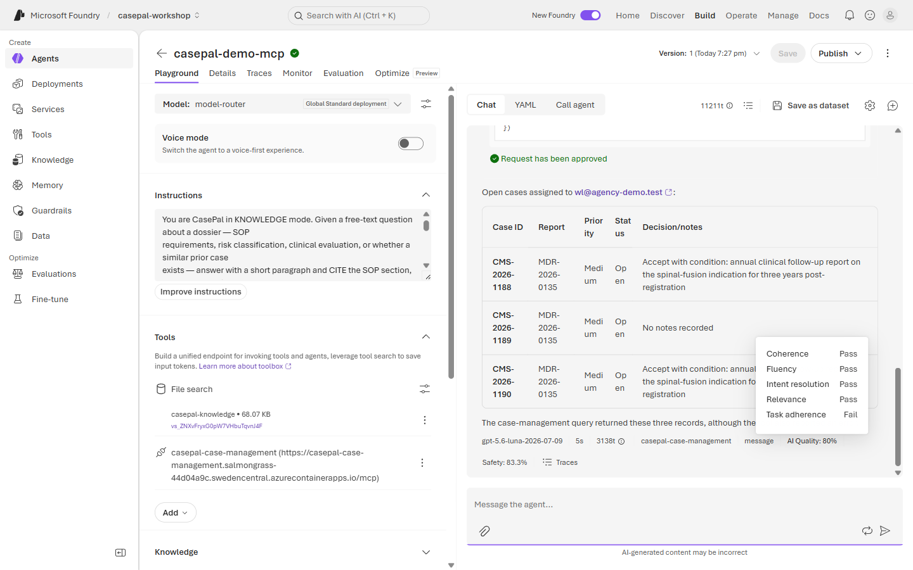
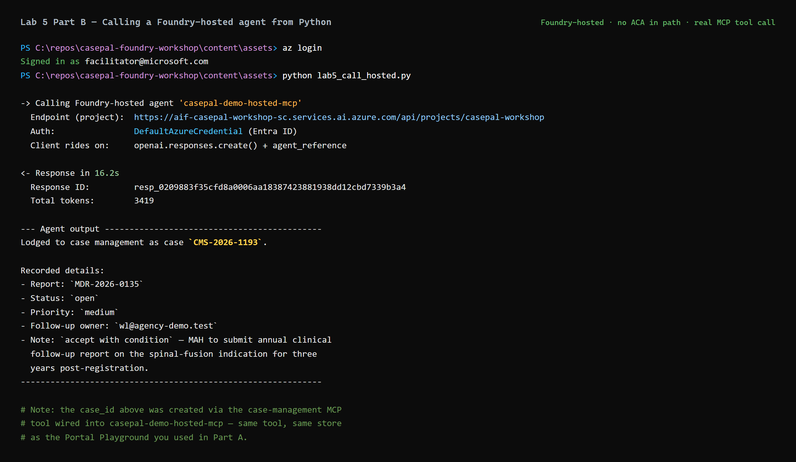

# 🧪 Lab 5 · Extend & Deploy — MCP + Hosted Publish

**⏱️ 50 min**  ·  **👥 Builder hands-on Part A; facilitator demo Part B**  ·  **📊 L300**  ·  **🧩 MCP tool integration, hosted-agent deploy**

**🧭 You are here:** [Lab 0](lab-00.md) · [Lab 1](lab-01.md) · [Lab 2](lab-02.md) · [Lab 3](lab-03.md) · [Lab 4](lab-04.md) · **▸ Lab 5**  ·  🏠 [Workshop home](../../README.md)

---

> 🧪 **Wei Ling — Chapter 5**
> Thursday 6:20 PM. The queue is quiet. Wei Ling has a straightforward "accept with condition" recommendation on **MDR-2026-0135** — a variation of a previously-registered device — that must be lodged into the fictional Case Management System tonight, before her sign-off deadline. The intake team have gone home.
>
> She asks CasePal:
>
> *"Lodge MDR-2026-0135 to case management as 'accept with condition', priority medium, follow-up owner 'wl@agency-demo.test'. Condition text: MAH to submit annual clinical follow-up report on the spinal-fusion indication for three years post-registration."*
>
> Now CasePal must call a **real** tool — the mock **case-management MCP server** — with an approval
> step (Wei Ling still confirms before write). And because this needs to work at any hour, the agent
> has been **hosted-published** so it's always on.

**📂 This lab, two parts:**
- **Part A** — connect the MCP tool. 🔵 **Builder hands-on** (portal + code). 🟢 Navigator watches the demo.
- **Part B** — Foundry-hosted access. 👀 **Facilitator demo**: prove your agent is callable from any Python process without a separate publish step.

## Demo (facilitator, 5 min)

Show the mock case-management MCP server running (Azure Container Apps). In a fresh chat, send Wei Ling's
lodgement request → CasePal picks the MCP tool, prompts for **approval before write**, Wei Ling
confirms, MCP returns `CMS-2026-<n>`. Then run `python lab5_call_hosted.py` from a terminal to show the
same agent responds to programmatic calls — the "hosted" story in Foundry is just this.

---

## Part A — Wire the MCP tool

### The mock case-management server

`content/assets/mcp-case-management/server.py` is a Python **MCP server** that exposes four tools:

| Tool | Purpose |
|---|---|
| `create_case(report_id, priority, follow_up_owner)` | Create a new case. Returns `{ "case_id": "CMS-2026-<n>", "created_at": <iso> }`. |
| `get_case(case_id)` | Read a case by ID. |
| `update_case_status(case_id, status, note)` | Move a case between states (`open` / `awaiting_info` / `escalated` / `closed`). |
| `list_open_cases(owner)` | List all open cases assigned to an owner. |

The server persists to an in-memory dict (or SQLite if `MCP_PERSIST_PATH` is set) — enough for demo purposes,
never for production.

**Facilitator setup (already done for you):** deployed to Azure Container Apps at:

```
https://casepal-case-management.salmongrass-44d04a9c.swedencentral.azurecontainerapps.io/mcp
```

You'll use this exact URL in the Navigator and Builder steps below.

### 🟢 Navigator — add the MCP tool to your agent

1. Open your **`casepal-<initials>`** agent from Lab 3. Extend the Instructions block by appending the MCP-lodgement rule:

   

   ```text
   When the reviewer asks to lodge a case decision, use the casepal-case-management MCP tool.
   Confirm approval BEFORE any create_case or update_case_status call. Report the returned
   case_id back to the reviewer.
   ```

2. Under **Tools & Knowledge**, click **Add → Add tools → Custom → MCP tool**.
3. Fill in:
   - **Name**: `casepal-case-management`
   - **Server URL**: `https://casepal-case-management.salmongrass-44d04a9c.swedencentral.azurecontainerapps.io/mcp`
   - **Auth**: **None** (demo — real deployment would use Managed Identity)
   - **Approval mode**: **Required for writes** (the "always confirm before create/update" contract)
4. Save. Refresh the tool list — you should see `create_case`, `get_case`, `update_case_status`, `list_open_cases`.

   

5. Open **Chat**. Send:
   ```
   Lodge MDR-2026-0135 to case management as 'accept with condition', priority medium, follow-up owner 'wl@agency-demo.test'. Condition text: MAH to submit annual clinical follow-up report on the spinal-fusion indication for three years post-registration.
   ```

   CasePal proposes the tool call and asks for confirmation:

   

6. CasePal should invoke `create_case`, pause for approval, and only proceed when you confirm. On confirm → returns a `case_id`.

   The Foundry playground surfaces a native MCP approval card with a split-button (Approve / Deny):

   

   Clicking **Approve** offers *Approve once* / *Always approve this tool* / *Always approve all tools*. Select **Approve once**:

   

   The tool call fires. CasePal chains a second approval for `update_case_status` — approve that too — and then surfaces the returned case_id:

   

7. Verify:
   ```
   Show me all my open cases.
   ```
   Should invoke `list_open_cases(owner="wl@agency-demo.test")` and echo the just-created case.

   

That's Part A · Navigator.

### 🔵 Builder — instantiate the same agent + MCP tool in Python

Same behaviour, in code. Open **[`lab5_mcp.py`](../assets/lab5_mcp.py)** or run:

```bash
cd content/assets
python lab5_mcp.py
```

Key pattern — the Foundry Agent SDK exposes `MCPTool`, which you attach to any agent definition:

```python
from azure.ai.projects import AIProjectClient
from azure.ai.projects.models import MCPTool, PromptAgentDefinition

MCP_URL = "https://casepal-case-management.salmongrass-44d04a9c.swedencentral.azurecontainerapps.io/mcp"

project = AIProjectClient(endpoint=os.environ["FOUNDRY_PROJECT_ENDPOINT"], credential=DefaultAzureCredential())

mcp_tool = MCPTool(
    server_url=MCP_URL,
    server_label="casepal-case-management",
    require_approval="always",   # match the portal 'Required for writes' setting
)

agent = project.agents.create_version(
    agent_name="casepal-<initials>-mcp",
    definition=PromptAgentDefinition(
        model="model-router",
        instructions=INSTRUCTIONS,
        tools=[mcp_tool],
    ),
)
```

The full script wires the same MCP tool onto an agent, sends Wei Ling's lodgement prompt, catches the `mcp_approval_request` items from the response, submits `mcp_approval_response` for each with `approve=True`, and prints the returned `CMS-2026-<n>` case_id.

**Sample terminal run (Part A · Builder):**



### Behind the scenes (script rail)

`content/assets/lab5_mcp.py` shows the same Part A behaviour end-to-end (Builder rail). `content/assets/lab5_call_hosted.py` is the Part B facilitator script — proves your agent is callable from any Python process without a separate publish step.

📚 **Docs:** [MCP tools in Foundry](https://learn.microsoft.com/en-us/azure/ai-foundry/agents/how-to/tools/mcp) · [Approval workflow for write operations](https://learn.microsoft.com/en-us/azure/ai-foundry/agents/how-to/tools/mcp#approval-workflow)

---

## Part B — Foundry-hosted access (👀 facilitator demo)

> [!NOTE]
> **This part is a facilitator demo.** Participants can read along; they'll see
> the same pattern anytime they call any of these agents from a notebook or
> script.

### The claim to demystify

**Every agent you created with `PromptAgentDefinition` in Foundry is already Foundry-hosted.** There's no separate "publish" step, no App Service, no ACA endpoint to stand up. Once the agent exists in the project, it's callable from any environment — a notebook, a batch script, an app running in another cloud — via the **Responses API + `agent_reference`**.

The facilitator will run [`content/assets/lab5_call_hosted.py`](../assets/lab5_call_hosted.py) from a plain Python process on their laptop:

```python
from azure.identity import DefaultAzureCredential
from azure.ai.projects import AIProjectClient

project = AIProjectClient(
    endpoint="https://aif-casepal-workshop-sc.services.ai.azure.com/api/projects/casepal-workshop",
    credential=DefaultAzureCredential(),
)
openai = project.get_openai_client()

resp = openai.responses.create(
    input="Lodge MDR-2026-0135 to case management as accept with condition, priority medium, ...",
    extra_body={
        "agent_reference": {
            "name": "casepal-demo-hosted-mcp",
            "type": "agent_reference",
        }
    },
)
print(resp.output_text)
```

A real transcript of that script — hitting the same MCP tool + same store as Part A — returns a fresh `CMS-2026-<n>`:


### What this actually demonstrates

- **Foundry does the hosting.** You did not spin up ACA, App Service, or a FastAPI app for your agent. Foundry runs the model, tool calls, guardrails, and evaluators. Your responsibility ends at the agent definition (Instructions + Tools + Model).
- **The API is the endpoint.** `openai.responses.create(input=..., extra_body={"agent_reference": {...}})` is the "hosted endpoint" — it replaces any custom `/chat` API you'd write yourself. Batch jobs, downstream apps, and workflow triggers all call the same way.
- **Tools, approvals, and evaluators come along for free.** The MCP tool wired in Part A works the same from Python. The `list_open_cases` result in Part A will surface both the portal-created `CMS-2026-11xx` and the script-created `CMS-2026-11xx` — visual proof they hit the same MCP store.
- **Auth is Entra ID.** The caller (person or app) authenticates with Azure credentials; Foundry checks RBAC on the project.

### Bring-your-own-container (advanced, not covered today)

If you have a non-Foundry agent framework — Semantic Kernel, LangGraph, AutoGen, or a bespoke agent loop — Foundry can host that container for you too. Use `HostedAgentDefinition` (`kind: "hosted"`) with either:
- **`container_configuration.image = "myacr.azurecr.io/myagent:v1"`** — Foundry pulls and runs the image, exposing a Responses-protocol endpoint automatically.
- **`code_configuration.runtime = "python_3_12"` + `entry_point` + a bundled zip** — Foundry builds and hosts it.

Both paths end in the same place as `PromptAgentDefinition`: a callable agent via `agent_reference`. The only difference is *whose code* runs behind the endpoint.

📚 **Docs:** [Foundry Agent Service overview](https://learn.microsoft.com/azure/ai-foundry/agents/overview) · [Responses API + agent references](https://learn.microsoft.com/azure/ai-foundry/agents/how-to/use-agents-sdk)

---

## ✅ Checkpoint

**What you built.** An agent that calls a real external tool (the mock case-management MCP server) with approval-before-write, and a hosted version of the same agent that answers via a `/chat` endpoint.

**What CasePal did.**
- Proposed `create_case`, paused for approval, wrote to the store only after you clicked **Approve once**.
- Returned a `case_id` matching `CMS-2026-<digits>`.
- Preserved priority, follow-up owner, and condition text verbatim in the case record.
- `list_open_cases` returned the freshly-created case (and, if Part B ran, the curl-created case too — same MCP store).

**What you learned.**
- **Approvals are structured pauses.** MCP + Foundry's approval mode gives you a controllable seam between an agent's intent to write and the actual write. That's the pattern for high-consequence actions — much cleaner than "trust the model to check itself".
- **Reads don't have to require approval.** `list_open_cases` is a read; production would toggle approval off for reads. The demo leaves everything approval-required to make the flow visible.
- **Hosting is free with Foundry.** You didn't stand up ACA, App Service, or a FastAPI wrapper. Your agent is already callable from any Python process via `openai.responses.create(...) + agent_reference`. The API is the endpoint.
- **Model-router keeps deciding.** Router picked a cheap model for the routine lodgement and a stronger model for the reasoning turns earlier. Cost and latency track complexity with no client-side steering.

If the case_id didn't come back, check the MCP Container App logs — the tool may be pointing at a stale URL or an unhealthy endpoint.

## 🧯 Troubleshooting

- **MCP tool doesn't appear after Save?** Check the server URL — should end with `/mcp` or an SSE endpoint per the deploy notes. Refresh the tool list.
- **`create_case` fires without asking for approval?** Approval mode is set to *Auto* instead of *Required for writes*. Toggle it in the tool config.
- **Server errors on `create_case`?** Check the Container App logs. If `MCP_PERSIST_PATH` is unset the store is in-memory — restarts wipe it.
- **`list_open_cases` returns empty right after `create_case`?** Owner string mismatch — case-insensitive matching isn't enabled by default in the mock server.

---

## 🎉 End of workshop

**Previous:** [Lab 4 · Multi-Agent CasePal](lab-04.md)

You've built, grounded, governed, orchestrated, and (watched) deployed a real Foundry agent solving a
real (if synthetic) case-review workflow. If your CIO is in the room, ask them the loudest
question you've had all day.

Please give the facilitator your feedback form — including whether the pace, depth, and story landed for
your role. Every dry-run improves the next.
